# CaseTracker Pro - Architecture Documentation

## System Architecture Overview

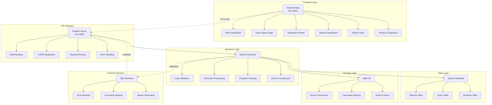

## Data Flow Architecture

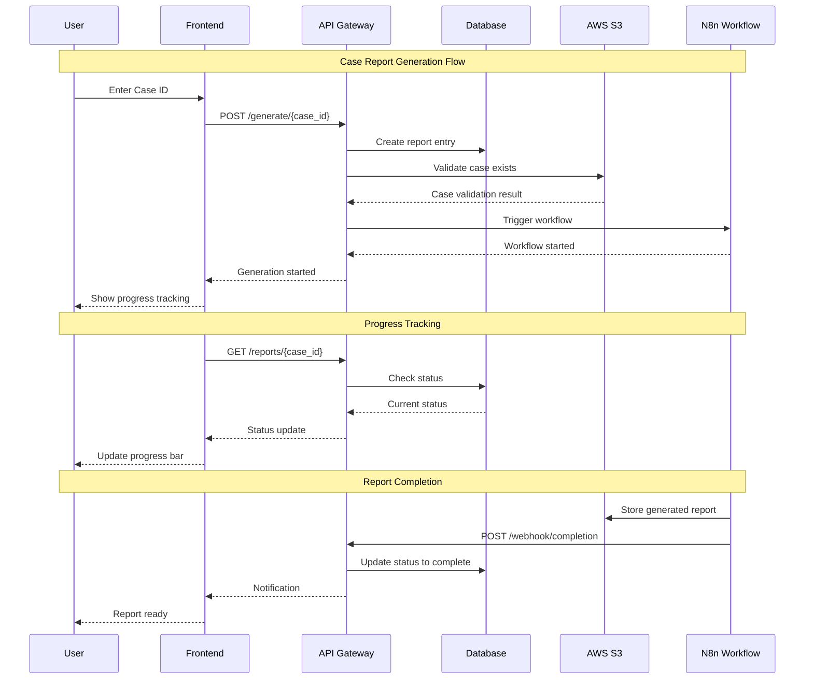

## Component Architecture

### Frontend Components

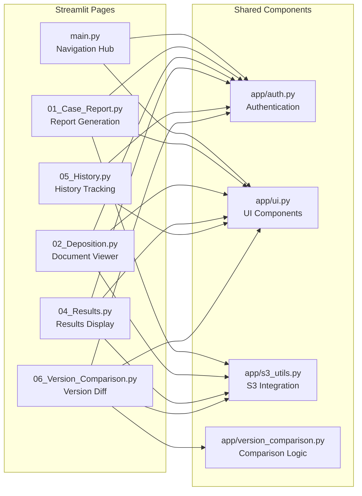

### Backend Components

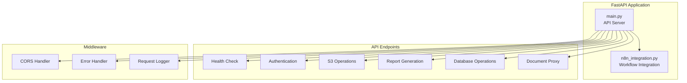

## Database Schema

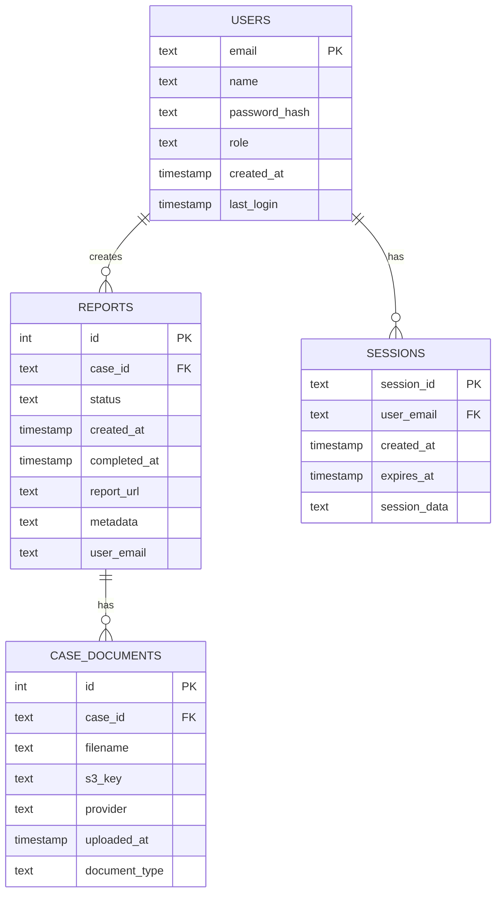

## Security Architecture

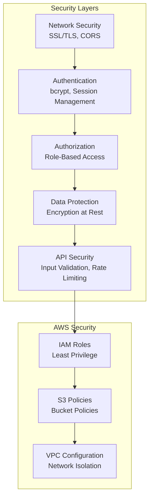

## Deployment Architecture

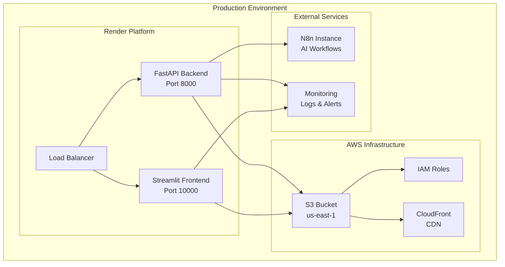

## Technology Stack Details

### Frontend Stack
- **Streamlit 1.28.1**: Python web framework for data apps
- **Streamlit Extras 0.3.5**: Additional UI components
- **Python 3.8+**: Runtime environment
- **HTML/CSS**: Custom styling and layout

### Backend Stack
- **FastAPI 0.104.1**: Modern Python web framework
- **Uvicorn 0.24.0**: ASGI server
- **SQLite 3**: Embedded database
- **Boto3 1.34.0**: AWS SDK

### Infrastructure Stack
- **AWS S3**: Object storage
- **AWS IAM**: Identity and access management
- **Render**: PaaS for deployment
- **N8n**: Workflow automation
- **GitHub**: Version control and CI/CD

## Performance Architecture

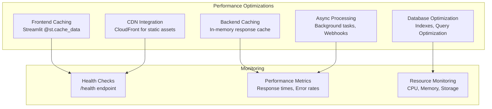

## Scaling Architecture

### Horizontal Scaling Strategy
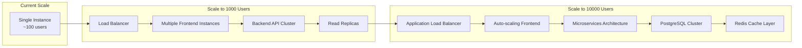

## Integration Architecture

### Third-Party Integrations
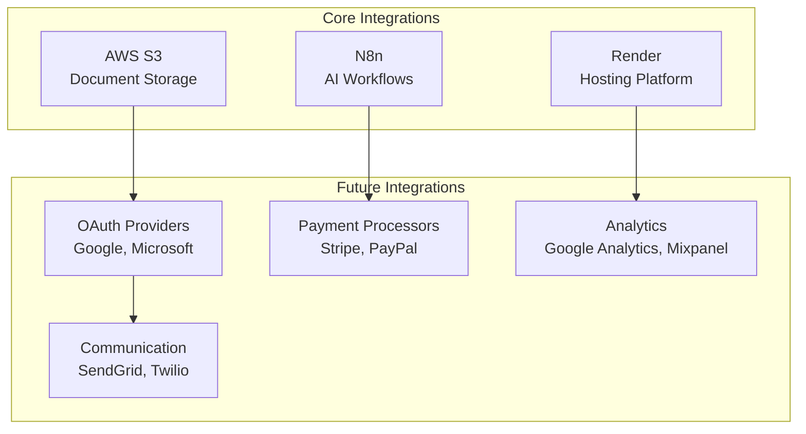

## Data Architecture

### Data Flow Patterns
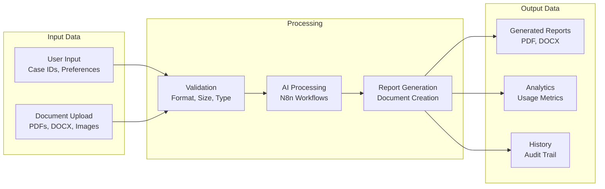

## Monitoring & Observability

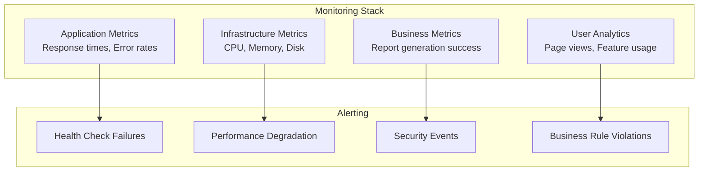

## Development Architecture

### Code Organization
```
basic-streamlit-ui/
├── 📁 frontend/
│   ├── 📄 main.py                 # Entry point
│   ├── 📁 pages/                  # Streamlit pages
│   └── 📁 app/                    # Shared components
├── 📁 backend/
│   ├── 📄 main.py                 # API server
│   └── 📄 n8n_integration.py      # External integrations
├── 📁 docs/                       # Documentation
├── 📁 config/                     # Configuration files
├── 📄 requirements.txt            # Dependencies
└── 📄 deploy/                     # Deployment scripts
```

### Development Workflow
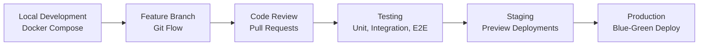
